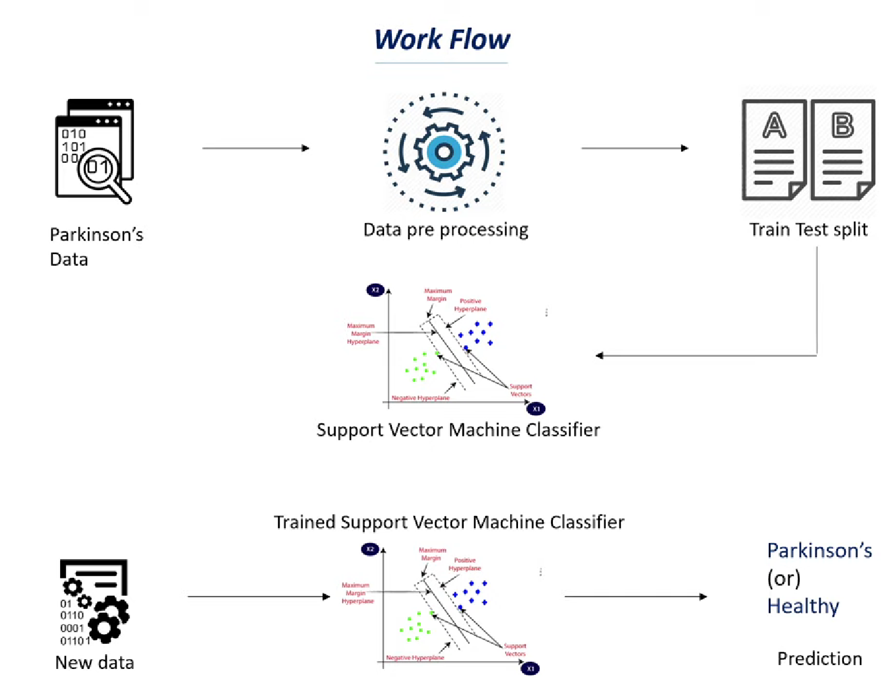

# Parkinson-s-Disease-Detection-using-Machine-Learning
This project aims to detect Parkinson’s disease in patients using a supervised machine learning model built with Python. The model is trained on a biomedical voice measurement dataset and uses an SVM classifier to predict the likelihood of Parkinson’s based on vocal features.

---

**📊 Features**

🧬 Biomedical Data Analysis

Utilizes the UCI Parkinson's dataset, containing biomedical voice measurements

22 features including MDVP frequency, jitter, shimmer, and PPE values

Labelled data (status: 0 for healthy, 1 for Parkinson’s)

🧠 ML Model for Detection

Trained an SVM (Support Vector Machine) classifier for binary classification

Achieved strong performance on both training and test datasets

Supports predictions on new data inputs

⚙️ Data Preprocessing

Dropped irrelevant columns (name)

Feature normalization using StandardScaler

Train-Test split (80/20) using train_test_split

📈 Model Training & Evaluation

SVM model trained using sklearn.svm.SVC

Evaluated with accuracy score from sklearn.metrics

Demonstrates clear separation of classes post-training

🧪 Interactive Predictions

Custom data input allows prediction on unseen patient voice metrics

Sample prediction provided at the end of the notebook

---

**Workfow Diagram**

---

**🛠️ Technologies Used**

Python 3

Jupyter Notebook

pandas, numpy

scikit-learn (SVM, preprocessing, metrics)

---

**🚀 How to Use**

Clone or download this repository

Place parkinsons.csv in the same directory

Open the notebook in Jupyter/Colab

Run all cells to load data, train the model, and test predictions

Use your own data in the input section to check for prediction output

---

**📁 File Structure**

rust
Copy
Edit
📁 Parkinsons-Detection-ML/
 ┣ 📄 Parkinson's_Disease_Detection_using_ML.ipynb
 ┗ 📄 parkinsons.csv
📌 Project Goals

Build an ML model for early detection of Parkinson’s

Provide a reproducible notebook with clear steps from loading to inference

Allow extension into medical diagnostics or integration into health apps

---

**🤝 Contributing**

Feel free to fork and enhance the project:

Try other ML models (e.g., Random Forest, XGBoost)

Visualize feature importance

Create a web app interface using Streamlit or Flask

---

**📬 Contact**

For feedback or collaboration, raise an issue or connect via GitHub.

LinkedIn: [Sarvesh Chavan](https://linkedin.com/in/sarvesh-chavan)

---

**📝 Note:** The model is trained on biomedical data and is not intended for real medical diagnosis without proper clinical validation.

---

**TO DOWNLOAD THE PROJECT :-**

[Parkinson's_Disease_Detection_using_ML.ipynb](https://drive.google.com/file/d/1ZD13eIHVPSdj1PymtmKgyWy3jM5HK--e/view?usp=sharing)
